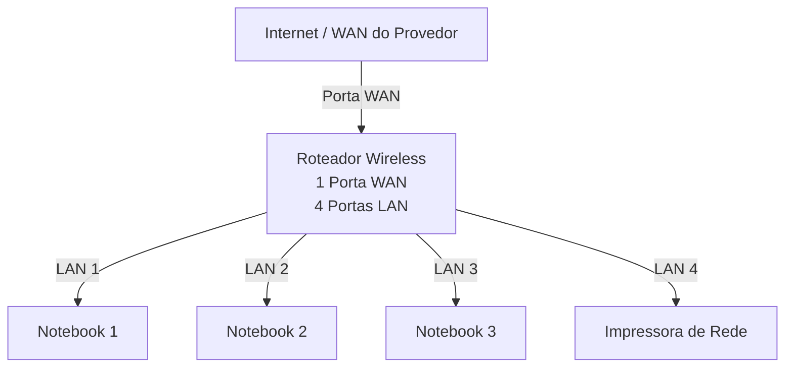
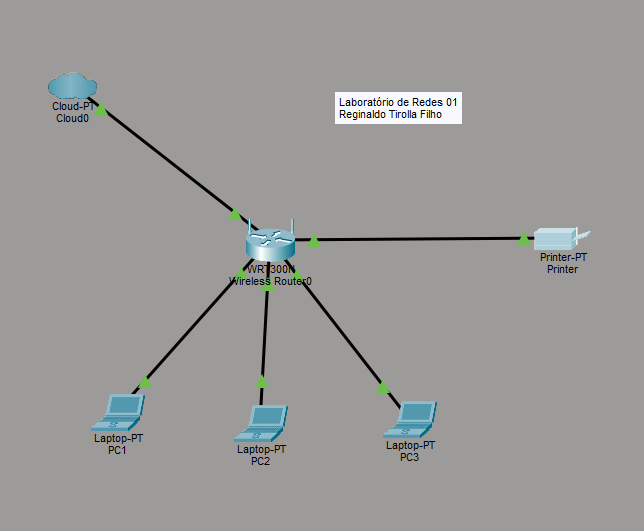

# Laboratório de Redes 01 - Projeto de Rede Local

Aluno: Reginaldo  

Professor: José de Assis

Data: 09/03/2026

---

## 1. Objetivo  
Implementar uma rede local simples conectando 4 notebooks a um roteador wireless com switch e uma impressora de rede.

O projeto será dividido em duas etapas:

1. Simulação da rede no Cisco packet Tracer
2. Implementação da rede no laboratório real

---

## 2. Equipamentos utilizados neste laboratório:

- 3 Notebooks
- 1 Roteador wireless com q porta LAN e 4 portas LAN
- 1 Impressora de rede
- Cabos de rede

---

## 2. Topologia da Rede

Diagrama lógico da rede usada nesta laboratório.

Imagem da Topologia usada neste laboratório:

---

## 4. Plano de endereçamento IP

Rede: 192.268.0.0/24

Geteway: 192.168.0.1

| Dispositovo  | Tipo de IP | Endereço  IP | Observação |
|-------------|-------------|-------------|-------------|
| Roteador | Estático | 192.168.0.1 | IP do Roteador |
| impressora | Reserva DHCP | 192.168.0.102 | IP reservado pelo roteador |
| PC1 | Reserva DHCP | 192.168.0.104 | IP reservado pelo roteador |
| PC2 | DHCP | Automático | IP atribuído pelo roteador |
| PC3 | DHCP | Automático | IP atribuído pelo roteador |

**Observação**

- A Impressora e um dos notebooks utilizam reserva DHCP.
- O roteador sempre atribui o mesmo endereço IP a esses dispositivos.

---

## 5. Conclusão 

Este laboratório permitiu  compreender o funionamento de uma rede local simples, incluindo:

- Estrutura de uma rede doméstica ou de pequeno escritório
- Utilização de um roteador com porta WAN e portas LAN
- Funcionamento do DHCP
- Comunicação entre dispositivos na rede local
- Utiicação de uma impressora de rede
- Compartilhamento de pasta na rede usando o windows
- Jogos em rede

